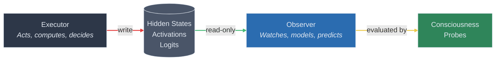
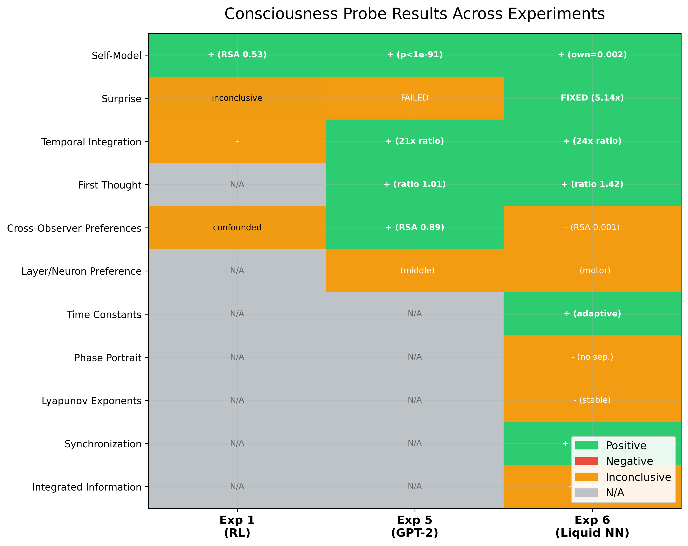

# Mind and Body: The Observer Hypothesis of Consciousness

> *"We don't author our thoughts — we witness them."*

[](https://www.python.org/downloads/)
[](LICENSE)
[](#the-six-experiments)
[](#key-results)

**If the universe is deterministic, consciousness cannot be the author of thought — it must be the audience.** This project takes that premise seriously and tests it empirically. We construct AI systems split into an *executor* (that acts) and an *observer* (that watches, with no ability to influence the executor), then probe the observer for emergent properties that map onto scientific indicators of consciousness. Across three architectures — reinforcement learning, large language models, and liquid neural networks — we find consistent evidence that observation alone gives rise to self-models, temporal integration, and predictive surprise.

---

## Architecture

The single inviolable constraint: **the observer has no write access to the executor.** Information flows one way. This mirrors the human condition — you can watch your hand reach for coffee, but the reaching was decided before you knew about it (Libet, 1983).



The executor never receives feedback from the observer. The observer never modifies the executor's weights, states, or decisions. This one-way information flow is the architectural equivalent of the philosophical claim: consciousness observes but does not cause.

---

## Key Results

Probes were applied across three executor-observer architectures spanning different computational paradigms:

| Probe | Exp 1 (RL / CartPole) | Exp 5 (GPT-2 Activations) | Exp 6 (Liquid Neural Net) |
|:------|:---------------------:|:--------------------------:|:-------------------------:|
| **Self-Model** | + (RSA 0.53) | + (p < 1e-91) | + (own=0.002, other=22.2) |
| **Surprise** | inconclusive | FAILED | **FIXED** (5.14x, p<1e-15) |
| **Temporal Integration** | - | + (21x ratio) | + (24x ratio) |
| **First Thought > Deliberation** | N/A | + (ratio 1.01) | + (ratio 1.42) |
| **Cross-Observer Preferences** | confounded | + (RSA 0.89) | - (RSA 0.0005) |
| **Layer/Neuron Preference** | N/A | middle layers | motor neurons |
| **Time Constants** | N/A | N/A | + (adaptive, std/mean=3.1) |
| **Phase Portrait** | N/A | N/A | - (no separability) |
| **Lyapunov Exponents** | N/A | N/A | - (stable, not critical) |
| **Synchronization** | N/A | N/A | + (0.98 coherence) |
| **Integrated Information (Phi)** | N/A | N/A | - (negative) |

The pattern that emerges: **self-model, temporal integration, and first-thought accuracy are robust across architectures.** Surprise detection required a more rigorous experimental design but succeeded when the methodology was corrected. Several IIT-inspired measures did not reach significance — an honest null result that constrains the theory.



---

## The Surprise Story

The surprise probe asks: does the observer react differently when the executor encounters something unexpected? In Experiment 5 (GPT-2), we tested this with garden-path sentences — syntactically misleading constructions like *"The horse raced past the barn fell."* The observer showed no differential response. The probe failed.

Rather than discard the probe, we redesigned it for Experiment 6. The liquid neural network executor learns eight dynamical systems (Lorenz attractors, double pendulums, coupled oscillators, and others). Mid-sequence, we abruptly swap the underlying dynamics — replacing a chaotic Lorenz system with a damped sine wave, for instance. These transitions are mathematically unambiguous: the statistical structure of the state stream changes sharply at a known timepoint.

The result was decisive. The observer's prediction error spiked 5.14x higher at transition points compared to stable regions (p < 1e-15). The failure in Experiment 5 was not a failure of the observer — it was a failure of our stimulus design. Garden-path sentences are subtle for humans; they are near-invisible in GPT-2's residual stream. Dynamical system transitions are sharp, unambiguous discontinuities. This progression from failure to redesign to success is what iterative empirical work looks like.

---

## The Control Problem

Every positive result demands a control. In Experiment 6, we ran four controls: an untrained observer, a linear-only observer, an observer fed shuffled time steps, and an observer trained on a different executor. The untrained and linear controls failed most probes, as expected. The wrong-executor control confirmed that the observer's self-model is executor-specific.

But the shuffled-time control produced an uncomfortable result: it matched the trained observer on 6 out of 10 probes. An observer that receives the same hidden states in random order — destroying all temporal structure — still builds a functioning self-model, still detects surprise, still develops layer preferences. This means the observer is primarily building a statistical model of the executor's activation distribution, not a temporal narrative of unfolding computation. The "temporal integration" probe passes because shuffled sequences are statistically distinguishable from ordered ones, not because the observer tracks a story over time. This is a critical constraint on interpreting positive results, and we report it without softening it.

---

## The Six Experiments

### Experiment 1: RL Executor-Observer Separation


A DQN agent learns CartPole while a Transformer observer watches the executor's hidden states through a read-only channel. Four consciousness probes are applied. The self-model probe succeeds (RSA = 0.53), confirming the observer builds internal representations that correlate with the executor's state geometry. Other probes are inconclusive — CartPole's state space is too simple to produce discriminative signal.

**Key result:** Self-model emergence confirmed in the simplest possible setting, motivating more complex architectures.

### Experiment 2: The Confabulation Test


If the executor is perturbed mid-episode (policy swap, noise injection), does the observer confabulate a coherent explanation for the behavioral discontinuity — the way split-brain patients fabricate reasons for actions initiated by the disconnected hemisphere? The experimental protocol is fully designed; implementation awaits a sufficiently complex executor environment.

### Experiment 3: First Thought vs. Reasoned Explanation


Compares the observer's immediate, single-forward-pass prediction against its chain-of-thought deliberation. In humans, System 1 often outperforms System 2 on well-practiced tasks. If the observer shows the same pattern — fast predictions more accurate than slow reasoning — it mirrors a signature property of human consciousness.

### Experiment 4: LLM Executor-Observer


Claude Sonnet serves as both executor and observer (separate instances, strict information barrier). The executor solves five coding tasks using real tools (file I/O, shell execution). The observer watches the full state stream. Three perturbation types (prompt swap, error injection, model swap) test whether the observer detects and explains disruptions. Five consciousness probes are evaluated qualitatively and via LLM-as-judge.

**Key result:** Qualitative evidence of confabulation-like behavior when the executor is perturbed mid-task.

### Experiment 5: Transformer Observer on GPT-2 Activations


GPT-2 Small (124M parameters, 12 layers) generates text while a custom Transformer observer (6 layers, 512 dimensions) watches all 13 residual stream checkpoints. Four of six probes return positive indicators: self-model (p < 1e-91), temporal integration (21x ratio), first-thought accuracy, and cross-observer preferences (RSA 0.89). The surprise probe fails on garden-path sentences. Four controls (untrained, linear, shuffled, wrong-executor) validate the positive results.

**Key result:** Middle layers carry the most information for the observer — consistent with interpretability research showing that middle layers encode abstract features.

### Experiment 6: Liquid Neural Network Observer


A Continuous-time Flow Cell (CfC) executor with 64 hidden neurons learns eight dynamical systems spanning chaotic, periodic, and transient regimes. A CfC observer with 50 hidden neurons watches the executor's hidden states. Eleven probes are applied — the six original probes adapted for continuous dynamics, plus five LNN-specific probes (time constants, phase portrait reconstruction, Lyapunov exponents, synchronization, approximate Phi). Six of eleven probes return positive indicators. A scaling experiment (sizes 10 to 200) shows core probes are robust across scales.

**Key result:** Surprise probe succeeds (5.14x ratio, p < 1e-15) after failing in Experiment 5, validating the iterative redesign. Synchronization between executor and observer reaches 0.98 coherence without any training signal encouraging it.

---

## Theoretical Foundation

The observer hypothesis draws on and maps to several major theories of consciousness:

| Theory | How the Architecture Maps |
|:-------|:--------------------------|
| **Higher-Order Theories (HOT)** | The observer has representations *of* the executor's representations |
| **Attention Schema Theory** (Graziano) | The observer models what the executor attends to |
| **Global Workspace Theory** (Baars, Dehaene) | The observer is the "audience" of the workspace theater |
| **Integrated Information Theory** (Tononi) | Observer-executor coupling generates measurable integrated information |
| **Predictive Processing** (Clark, Friston) | The observer predicts executor next-states; prediction errors correspond to surprise and awareness |

The full theoretical development, including the argument from determinism, the first-thought insight, and connections to Buddhist philosophy, is in [`theory/foundation.md`](theory/foundation.md).

---

## Repository Structure

```
mind-and-body/
├── README.md                              # This file
├── RESULTS.md                             # Cross-experiment results narrative
├── RESEARCH_LOG.md                        # Chronological research session log
├── requirements.txt                       # Python dependencies
│
├── theory/
│   └── foundation.md                      # Full theoretical framework
│
├── docs/
│   ├── references.md                      # Academic references and citations
│   └── conversation_log.md                # Research discussion archive
│
├── figures/                               # Generated visualizations
│
├── experiment1_separation/                # RL CartPole executor-observer
│   ├── run_experiment.py
│   ├── executor/
│   ├── observer/
│   ├── shared/
│   └── analysis/
│
├── experiment2_confabulation/             # Theoretical design (confabulation test)
│   └── README.md
│
├── experiment3_first_thought/             # Theoretical design (first thought vs. reasoning)
│   └── README.md
│
├── experiment4_llm_observer/              # Claude API executor-observer
│   ├── run_experiment.py
│   ├── executor_engine.py
│   ├── observer_engine.py
│   ├── orchestrator.py
│   ├── perturbation_engine.py
│   └── probes.py
│
├── experiment5_transformer_observer/      # GPT-2 activations + Transformer observer
│   ├── run_experiment.py
│   ├── extract_activations.py
│   ├── observer_model.py
│   ├── probes.py
│   └── controls.py
│
├── experiment6_liquid_observer/           # Liquid neural network (CfC) observer
│   ├── run_experiment.py
│   ├── dynamical_systems.py
│   ├── executor_model.py
│   ├── observer_model.py
│   ├── probes.py
│   ├── dynamics_analysis.py
│   └── controls.py
│
└── scripts/
    └── generate_figures.py                # Reproducible figure generation
```

---

## Getting Started

### Prerequisites

- Python 3.10+
- CUDA-capable GPU recommended for Experiments 5 and 6
- Anthropic API key required for Experiment 4

### Installation

```bash
git clone https://github.com/arjunvad123/mind-and-body.git
cd mind-and-body
pip install -r requirements.txt
```

### Running Experiments

**Experiment 1** (RL CartPole) — trains executor and observer, runs all probes:
```bash
python experiment1_separation/run_experiment.py
```

**Experiment 4** (LLM Observer) — requires `ANTHROPIC_API_KEY` environment variable:
```bash
export ANTHROPIC_API_KEY=your-key-here
python experiment4_llm_observer/run_experiment.py
```

**Experiment 5** (GPT-2 + Transformer Observer) — extracts activations, trains observer, evaluates probes:
```bash
python experiment5_transformer_observer/run_experiment.py
```

**Experiment 6** (Liquid Neural Network) — trains CfC executor on 8 dynamical systems, trains observer, runs 11 probes + controls:
```bash
python experiment6_liquid_observer/run_experiment.py
```

Experiments 2 and 3 are theoretical designs with documented protocols in their respective directories.

---

## References

1. **Libet, B.** (1983). Time of conscious intention to act in relation to onset of cerebral activity. *Brain*, 106(3), 623-642. The foundational finding that readiness potential precedes conscious awareness by 350-500ms.

2. **Soon, C. S., Brass, M., Heinze, H.-J., & Haynes, J.-D.** (2008). Unconscious determinants of free decisions in the human brain. *Nature Neuroscience*, 11(5), 543-545. fMRI predicts choices 7-10 seconds before subjects report deciding.

3. **Nisbett, R. E., & Wilson, T. D.** (1977). Telling more than we can know: Verbal reports on mental processes. *Psychological Review*, 84(3), 231-259. The classic demonstration that people confabulate reasons for their choices.

4. **Gazzaniga, M. S.** (2005). Forty-five years of split-brain research and still going strong. *Nature Reviews Neuroscience*, 6(8), 653-659. Split-brain patients and the left-hemisphere "interpreter" that fabricates explanations.

5. **Tononi, G.** (2008). Consciousness as integrated information: A provisional manifesto. *Biological Bulletin*, 215(3), 216-242. The theoretical framework for Integrated Information Theory (Phi).

6. **Graziano, M. S. A.** (2013). *Consciousness and the Social Brain*. Oxford University Press. Attention Schema Theory — consciousness as a model of attention.

For the complete reference list, see [`docs/references.md`](docs/references.md).

---

## Authors

- **Arjun Vad** — conception, experimental design, implementation, analysis
- **Claude** (Anthropic) — research collaborator, theoretical development, code implementation

---

## License

This project is licensed under the MIT License. See [LICENSE](LICENSE) for details.
